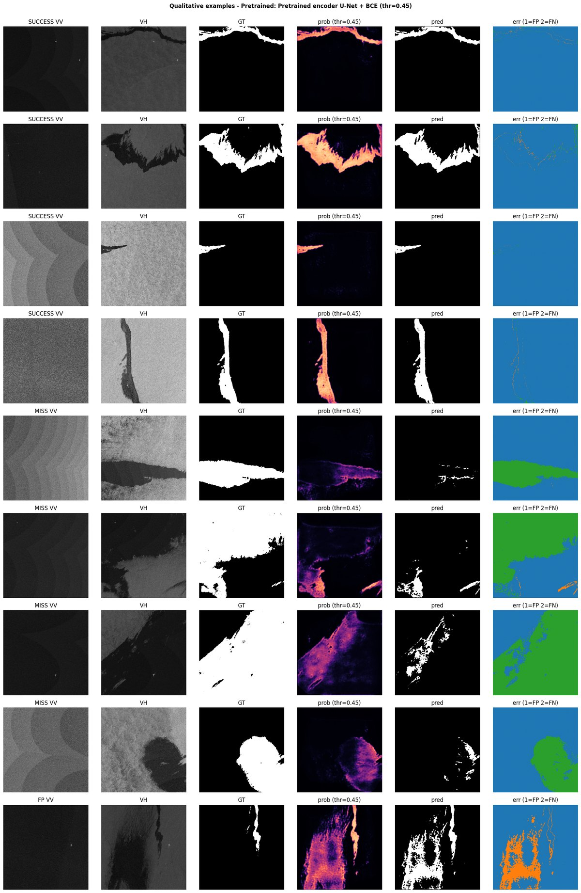
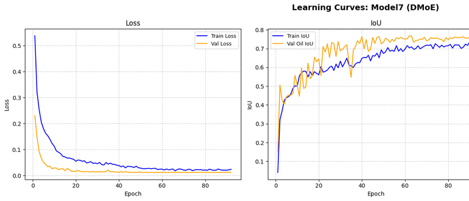

# Marine Oil-Spill Segmentation in Sentinel-1 SAR Imagery

[](https://colab.research.google.com/github/AsserGharib1/SAR-OilSpillSemanticSegmentation/blob/main/sar_oil_spill_segmentation.ipynb)
[](https://nbviewer.org/github/AsserGharib1/SAR-OilSpillSemanticSegmentation/blob/main/sar_oil_spill_segmentation.ipynb)

B.Sc. graduation dissertation (graded **A+**, British University in Egypt, 2026): *"A Hybrid Artificial Intelligence Pipeline for the Classification and Segmentation of Marine Oil Spills"*. The task: delineate oil slicks that occupy ~1% of each Sentinel-1 SAR scene and are easily confused with look-alike phenomena.

## Models

Five U-Net-family segmenters designed and trained from scratch in PyTorch under one controlled protocol (100 epochs each), plus a pretrained baseline:

| # | Architecture |
|---|---|
| 1 | Plain U-Net (baseline) |
| 2 | Residual-Attention U-Net |
| 3 | Shape-Transformer U-Net |
| 4 | ASPP + CBAM U-Net (polarimetric) |
| 5 | **DMoE — dual-attention Mixture-of-Experts U-Net (selected)** |
| — | Pretrained ResNet50-U-Net (reference) |

## Results (held-out test set — dataset Part III, 450 tiles)

| Configuration | Oil IoU |
|---|---|
| **DMoE, 5.2M params (selected)** | **0.7021** |
| Shape-Transformer + DMoE ensemble, 4-way TTA | 0.7175 |

- The 5.2M-parameter DMoE outperformed the pretrained ResNet50-U-Net more than twice its size — architectural capability, not raw scale, drove accuracy.
- A standalone scene classifier reached 0.9289 accuracy; hard gating reduced segmentation recall, so it was kept only as an optional fallback (documented ablation).
- Extreme ~1% class imbalance handled with a class-balanced weighted tile sampler, validation-tuned thresholds, and 95% bootstrap confidence intervals.
- Fault-tolerant Colab training on the 127 GB dataset: per-epoch checkpointing with auto-resume, gradient checkpointing, mixed precision, half-precision tile caching.

## Sample results

Qualitative test-set predictions (SAR input, ground truth, model prediction):



Training and validation history of the selected DMoE model (loss and oil IoU):



## Dataset

Public **Sentinel-1 SAR Oil Spill dataset** (Trujillo-Acatitla, Tuxpan-Vargas, Ovando-Vázquez & Monterrubio-Martínez; CC-BY 4.0). Parts I–II were used for training/validation and Part III as the held-out test set:

- Part I — DOI: [10.5281/zenodo.8346860](https://zenodo.org/records/8346860)
- Part II — DOI: [10.5281/zenodo.8253899](https://zenodo.org/records/8253899)
- Part III — DOI: [10.5281/zenodo.13761290](https://zenodo.org/records/13761290)

2048×2048 dual-polarization (VV, VH) Sigma0 tiles in dB with pixel-level ground-truth masks.

## Repository contents

- `sar_oil_spill_segmentation.ipynb` — full pipeline: preprocessing, augmentation, caching, five architectures, training, evaluation, ablations (outputs preserved; large images recompressed for browser rendering).
- `docs/thesis.pdf` — full dissertation. `docs/presentation.pdf` — defense slides.

## Running

```bash
pip install -r requirements.txt
```
Download the three dataset parts to Drive, point the config cell at them, run top-to-bottom on Colab (checkpointing resumes automatically).
